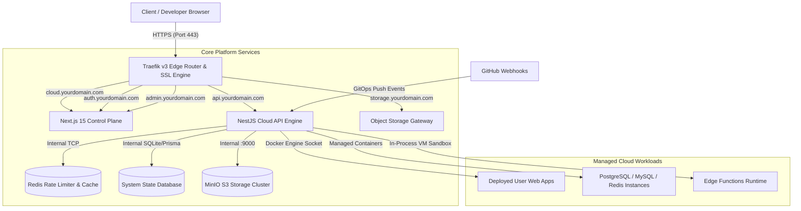

<div align="center">

# ⚡ KH Cloud

**Enterprise-Grade, Open-Source Self-Hosted Cloud Platform**  
*A complete self-hosted alternative to Vercel, Supabase, Railway, and Netlify.*

[](https://github.com/khawarahemad/KH-cloude/actions/workflows/ci.yml)
[](https://github.com/khawarahemad/KH-cloude/pkgs/container/kh-cloud-backend)
[](https://github.com/khawarahemad/KH-cloude/pkgs/container/kh-cloud-frontend)
[](https://github.com/khawarahemad/KH-cloude/releases/latest)
[](https://opensource.org/licenses/MIT)
[](https://nodejs.org)
[](https://nextjs.org)
[](https://nestjs.com)

<p align="center">
  <a href="#-quickstart-1-command-installation">Quickstart</a> •
  <a href="#-system-architecture">Architecture</a> •
  <a href="#-features--capabilities">Features</a> •
  <a href="#-self-hosting-guide">Deployment Guide</a> •
  <a href="#-updating--maintenance">Upgrades</a> •
  <a href="#-environment-configuration">Configuration</a>
</p>

</div>

---

## 📌 Overview

**KH Cloud** is a modern, full-stack cloud platform designed for developers, teams, and organizations who want the developer experience of **Vercel**, the database & storage capabilities of **Supabase**, and the infrastructure flexibility of **Railway**—hosted entirely on their own infrastructure with **zero vendor lock-in**.

Deploy full-stack applications with automatic GitOps CI/CD, managed databases (PostgreSQL, MySQL, Redis), S3-compatible object storage, sandboxed edge functions, and multi-tier DDoS protection under your own custom domains with zero source code modifications.

---

## ⚡ Quickstart: 1-Command Installation

Deploy a complete, production-ready KH Cloud cluster on any Ubuntu/Debian VPS in under 3 minutes:

```bash
curl -fsSL https://raw.githubusercontent.com/khawarahemad/KH-cloude/main/install.sh | bash
```

> **What the installer automates:**
> 1. Detects OS and installs Docker Engine & Docker Compose (if missing).
> 2. Prompts for your root domain (`yourdomain.com`) and Let's Encrypt email.
> 3. Generates cryptographically secure API keys and database credentials.
> 4. Sets up persistent storage directories and permissions under `/var/lib/kh-cloud/`.
> 5. Pulls pre-built multi-arch images from GitHub Container Registry (`ghcr.io`).
> 6. Configures Traefik v3 edge routing with automated TLS/SSL certificate issuance.

---

## 🔄 Updating & Maintenance

To update an existing installation to the latest release with **zero downtime and zero data loss**:

```bash
curl -fsSL https://raw.githubusercontent.com/khawarahemad/KH-cloude/main/update.sh | bash
```

*All persistent volumes (`/var/lib/kh-cloud/`), databases, storage files, and `.env` configuration remain completely intact across updates.*

---

## 🗺️ System Architecture


```mermaid
flowchart TD
    Client["Client / Developer Browser"] -->|"HTTPS (Port 443)"| Traefik["Traefik v3 Edge Router & SSL Engine"]
    
    subgraph CorePlatform["Core Platform Services"]
        Traefik -->|"cloud.yourdomain.com"| Frontend["Next.js 15 Control Plane"]
        Traefik -->|"api.yourdomain.com"| Backend["NestJS Cloud API Engine"]
        Traefik -->|"storage.yourdomain.com"| StorageCtrl["Object Storage Gateway"]
        Traefik -->|"auth.yourdomain.com"| Frontend
        Traefik -->|"admin.yourdomain.com"| Frontend
        Backend -->|"Internal TCP"| Redis[("Redis Rate Limiter & Cache")]
        Backend -->|"Internal SQLite/Prisma"| DB[("System State Database")]
        Backend -->|"Internal :9000"| MinIO[("MinIO S3 Storage Cluster")]
    end

    subgraph ManagedServices["Managed Cloud Workloads"]
        Backend -->|"Docker Engine Socket"| Containers["Deployed User Web Apps"]
        Backend -->|"Managed Containers"| ManagedDatabases["PostgreSQL / MySQL / Redis Instances"]
        Backend -->|"In-Process VM Sandbox"| EdgeFunctions["Edge Functions Runtime"]
    end

    GitHub["GitHub Webhooks"] -->|"GitOps Push Events"| Backend
```

---

## 🚀 Features & Capabilities

### 1. 🌐 Web App Hosting & Automated GitOps CI/CD
- **Native GitHub App Integration**: Selectively grant repository permissions without exposing account-wide tokens.
- **Automated Docker BuildKit Pipeline**: Push commits to your default branch to trigger automated container builds with isolated port allocation and zero-downtime rolling updates.
- **Automatic SSL Provisioning**: Automated Let's Encrypt TLS certificate generation and renewal for all apex domains and wildcard subdomains.
- **Secure Environment Injection**: Build-time `.env` synthesis for static client apps (Next.js, Vite, React) and runtime Docker `--env-file` isolation with instant one-click redeploy triggers.

### 2. 🗃️ Managed Databases (PostgreSQL, MySQL, Redis)
- **One-Click Provisioning**: Spin up isolated, containerized database instances instantly.
- **Interactive 2D Table Editor**: Spreadsheet-like data grid featuring sticky headers, column sorting, pagination, and inline CRUD record mutations.
- **Embedded SQL Console**: Execute raw SQL queries with formatted tabular result sets and execution timing.
- **HTTP REST Query Engine**: Securely perform database operations via RESTful endpoints authenticated by Team API keys (`kh_service_...` or `kh_anon_...`).
- **SDK Connection Snippets**: Ready-to-use boilerplate for Prisma ORM, SQLAlchemy, Node.js (`pg`, `mysql2`, `ioredis`), and Python (`requests`).

### 3. 📦 Universal S3-Compatible Object Storage
- **Universal File Support**: Upload, organize, and stream PDFs, images (JPG, PNG, WebP, SVG), video (MP4, WebM), audio (MP3, WAV), documents, and ZIP archives.
- **Integrated Previews**: In-dashboard PDF reader, HTML5 media player, and lossless image zoom viewer.
- **Deterministic URL Routing**:
  ```
  https://storage.yourdomain.com/:teamId/:bucketName/:objectKey
  ```
- **Standard S3 Protocol Compatibility**: Works out-of-the-box with AWS SDK v3, `boto3`, MinIO Client (`mc`), and standard HTTP clients.

### 4. ⚡ Serverless Edge Functions
- **Zero-Latency Compute**: Sub-millisecond cold starts powered by an isolated Node.js VM context.
- **Pre-Bound Global Utilities**: Sandbox environment includes `req`, `env`, `storage` (S3 helpers), `db` (query runner), and `fetch`.
- **Flexible Invocations**: Call edge functions publicly or restrict access via Team API keys.

### 5. 👥 Multi-Tenant Team System & RBAC
- **Isolated Team Namespaces**: Multi-tenant architecture prevents naming collisions across teams.
- **Role-Based Access Control (RBAC)**: Enforces `OWNER`, `ADMIN`, `DEVELOPER`, and `VIEWER` permission hierarchies.
- **Team Invitations**: Manage team growth with secure email invites and role pre-assignment.
- **Scoped API Tokens**: Granular `anon` (client-safe) and `service_role` (elevated admin) tokens.

### 6. 🛡️ Two-Tier DDoS Protection & Security Engine
- **Edge Layer Protection**: Traefik network rate-limiting intercepts and throttles traffic before it reaches application processes.
- **Application Layer Sliding-Window**: Redis-backed token bucket algorithm in NestJS handles granular route rate-limiting.
- **Intelligent Auto-Ban Engine**: Automatically isolates abusive IP addresses with configurable TTL durations.
### 7. 🛡️ Automated Disaster Recovery & Encrypted Remote Backups
- **AES-256-CBC PBKDF2 Encryption**: Complete snapshots bundling SQLite DB, MinIO object storage files, SSL certificates (`acme.json`), and platform configuration (`.env`).
- **Automated Remote Sync**: Daily or on-demand push to a **Private GitHub Backup Repository** (via GitHub Releases API) or **Remote S3 / Cloudflare R2 / AWS S3**.
- **1-Command VPS Restore**: Restore your entire cloud onto a brand-new VPS with zero data loss in under 3 minutes:
  ```bash
  curl -fsSL https://raw.githubusercontent.com/khawarahemad/KH-cloude/main/restore.sh | bash
  ```

---

## 🚑 Disaster Recovery & Migration Guide

If your VPS ever crashes, is destroyed, or you wish to migrate to a new hosting provider, KH Cloud makes restoration effortless.

### Option 1: 1-Command Restore on a Fresh VPS
On your replacement Ubuntu/Debian server:
```bash
curl -fsSL https://raw.githubusercontent.com/khawarahemad/KH-cloude/main/restore.sh | bash
```
The wizard will:
1. Automatically install Docker & Compose.
2. Fetch your encrypted snapshot from your **Private GitHub Repo**, **Cloudflare R2/S3**, or a local file.
3. Prompt for your `BACKUP_ENCRYPTION_KEY` to decrypt the snapshot.
4. Restore all databases, MinIO files, SSL certificates, and `.env`.
5. Pull pre-built GHCR images and launch the cluster!

### Option 2: CLI On-Demand Snapshot
To create an encrypted snapshot from the command line on your active server:
```bash
./backup.sh
```

---

## ⚙️ Environment Configuration Reference

| Variable | Description | Default / Example |
| :--- | :--- | :--- |
| `BASE_DOMAIN` | Root domain for routing and SSL certificates | `yourdomain.com` |
| `ACME_EMAIL` | Email address registered with Let's Encrypt | `admin@yourdomain.com` |
| `ADMIN_API_KEY` | Secret bearer token for admin API endpoints | *(Generate strong random string)* |
| `BACKUP_ENCRYPTION_KEY` | Master AES-256 key for encrypting backup snapshots | *(Generate strong 32-byte string)* |
| `BACKUP_GITHUB_REPO` | Optional: Private GitHub backup target repo | `your-username/my-khcloud-backups` |
| `BACKUP_GITHUB_TOKEN` | Optional: GitHub Personal Access Token (PAT) | `ghp_...` |
| `BACKUP_S3_ENDPOINT` | Optional: Cloudflare R2 or AWS S3 endpoint URL | `https://<id>.r2.cloudflarestorage.com` |
| `BACKUP_S3_BUCKET` | Optional: Remote S3 backup bucket name | `my-khcloud-backups` |
| `MINIO_ROOT_USER` | S3 storage administrator username | `khcloudroot` |
| `MINIO_ROOT_PASSWORD` | S3 storage administrator password | *(Generate strong random string)* |
| `GOOGLE_CLIENT_ID` | Google OAuth Client ID for dashboard authentication | `*.apps.googleusercontent.com` |
| `GOOGLE_CLIENT_SECRET`| Google OAuth Client Secret | `GOCSPX-...` |
| `GITHUB_APP_ID` | GitHub App ID for GitOps deployments | `123456` |
| `GITHUB_APP_PRIVATE_KEY`| GitHub App PEM private key (newlines as `\n`) | `"-----BEGIN RSA...-----"` |
| `GITHUB_APP_WEBHOOK_SECRET` | Secret for verifying GitHub webhook HMAC signatures | `your_webhook_secret` |
| `DDOS_GLOBAL_LIMIT` | Global requests per minute before rate-limiting | `200` |
| `DDOS_API_LIMIT` | API requests per minute before rate-limiting | `60` |
| `DDOS_BAN_THRESHOLD` | Violations before IP auto-ban is enforced | `5` |
| `DDOS_BAN_TTL_SECONDS` | Duration in seconds for temporary IP bans | `3600` |

---

## 🌐 Platform Endpoints Reference

Once deployed with your `BASE_DOMAIN`, the following endpoints are automatically routed with SSL certificates:

| Endpoint | Subdomain | Purpose |
| :--- | :--- | :--- |
| **Control Plane** | `https://cloud.yourdomain.com` | Next.js 15 Web Dashboard & Project Workspace |
| **Auth Hub** | `https://auth.yourdomain.com` | Dedicated OAuth Gateway & Session Router |
| **Backend API** | `https://api.yourdomain.com` | NestJS REST API & GitHub Webhook Receiver |
| **Object Storage** | `https://storage.yourdomain.com` | S3 Gateway & Media Streaming CDN |
| **Admin Console** | `https://admin.yourdomain.com` | Platform Administration, Logs, & Security Metrics |
| **User Deployments**| `https://<project-slug>.yourdomain.com` | Deployed user web applications |

---

## 📄 License & Community

- **License**: Released under the [MIT License](LICENSE).
- **Contributing**: Contributions, issues, and feature requests are welcome. Please open an issue or pull request on GitHub.
- **Repository**: [https://github.com/khawarahemad/KH-cloude](https://github.com/khawarahemad/KH-cloude)
